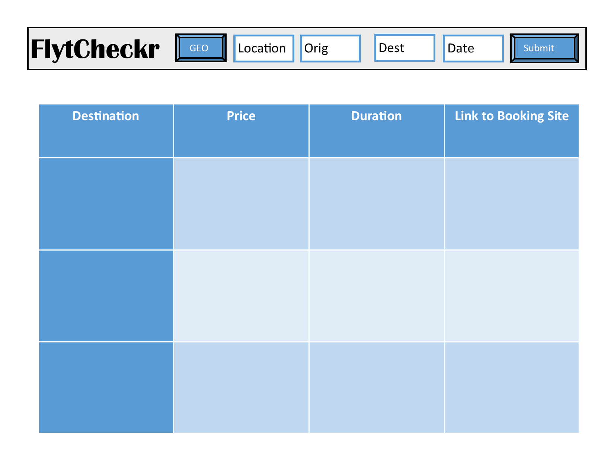

# FlytCheckr

## Description
 

## Installation

Follow these steps to install this project on your local machine.

- Open Bash editor
- mkdir 
- cd 
- git clone https://

## Application

Link to Deployed Application: https://

## License

Non-Software Licenses
Open source software licenses can be also used for non-software works and are often the best choice, especially when the works in question can be edited and versioned as source (e.g., open source hardware designs). Choose an open source license here.

Data, media, etc.
CC0-1.0, CC-BY-4.0, and CC-BY-SA-4.0 are open licenses used for non-software material ranging from datasets to videos. Note that CC-BY-4.0 and CC-BY-SA-4.0 should not be used for software.

Documentation
Any open source software license or open license for media (see above) also applies to software documentation. If you use different licenses for your software and its documentation, be sure to specify that source code examples in the documentation are also licensed under the software license.

Fonts
The SIL Open Font License 1.1 keeps fonts open, allowing them to be freely used in other works.

Mixed projects
If your project contains a mix of software and other material, you can include multiple licenses, as long as you are explicit about which license applies to each part of the project. See the license notice for this site as an example.
